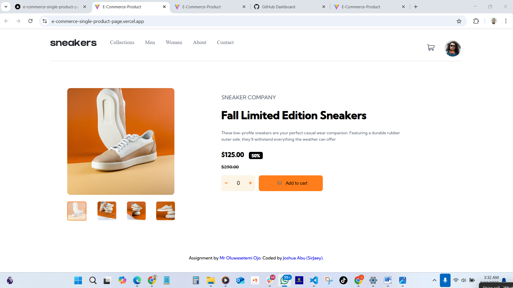
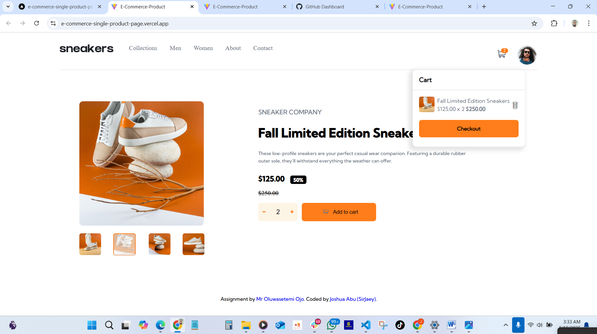

# 🧢 E-commerce Product Page (React + TypeScript + TailwindCSS)

This is a responsive e-commerce product page built with **React**, and **TypeScript**.  
It is based on the *Frontend Mentor – E-commerce Product Page* challenge.

The application mimics a single-product store, allowing users to preview product images, open a lightbox gallery, and add / remove items from the cart.

---

## 📌 Features

- **Responsive Layout**  
  Optimized for both **mobile** and **desktop** screens.

- **Thumbnail Gallery**  
  Click on a thumbnail image to update the large product preview.

- **Lightbox Modal**  
  Clicking the large product image opens a full-screen lightbox with navigation controls.

- **Cart Functionality**
  - Add products to the cart using the “Add to cart” button  
  - Cart quantity updates dynamically  
  - View cart items via the dropdown in the top-right of the page  
  - Remove items from the cart

- **Hover / Focus States**  
  All interactive elements include visible hover states (buttons, thumbnails, cart icon, etc.).

---

## 💡 Expected Behaviour

- [ ] **Users should be able to view the optimal layout** for the site depending on their device's screen size (mobile ↔ desktop).
- [ ] **Users should be able to see hover states** for all interactive elements on the page (buttons, thumbnails, cart icon, etc.).
- [ ] **Users should be able to open a lightbox gallery** by clicking on the large product image.
- [ ] **Users should be able to switch the large product image** by clicking on the small thumbnail images.
- [ ] **Users should be able to add items to the cart** by clicking the “Add to cart” button.
- [ ] **Users should be able to view the cart** by clicking on the cart icon and **remove items** from it.

---

## 🛠️ Technologies Used

- [React](https://reactjs.org/)
- [Typescript](https://www.typescriptlang.org/)

---

### 📥 Installation

1. **Clone the repository**
   ```bash
   git clone https://e-commerce-single-product-page.vercel.app
   cd interactive-card-details
   ```
2. **Install dependencies**
   ```bash
   pnpm install
   ```
3. **Start the development server**
   ```bash
   pnpm run dev
   ```
4. **Build for production**
   ```bash
   pnpm run build
   ```
5. **Preview the production build**
   ```bash
   pnpm run preview
   ```

---

## 🧰 Available Scripts & Commands

| Command           | Description                  |
| ----------------- | ---------------------------- |
| `pnpm run dev`     | Start development server     |
| `pnpm run build`   | Build the app for production |
| `pnpm run preview` | Preview built app locally    |

---

## ⚙️ Technology stack and architecture decisions

**⚙️ Tech Stack**

- React (with Hooks)

- Vite — for fast bundling and development

**🏗️ Architecture Decisions**

- Components

  - Attribution.tsx
  - Cart.tsx
  - DescriptionSection.tsx
  - ErrorBoundry
  - Lightbox.tsx
  - Nav.tsx
  - ProductsGallery.tsx

- App.css
- App.tsx
- Index.css
- Main.tsx - main

---

## Screenshots of key features





---

## 👤 Author

Frontend Developer | AltSchool | React + TypeScript Enthusiast

- GitHub - https://github.com/sirjaey
- LinkedIn - https://www.linkedin.com/in/joshua-abu-3180b0284/
- X (Twitter) - https://x.com/sirjaey_

---

## 🔗 Links

- Live Site URL: https://joshua-abu-e-commerce-single-product-page.vercel.app/
